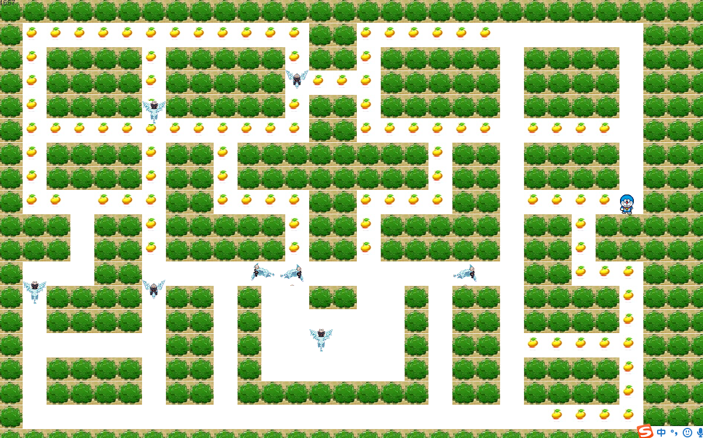
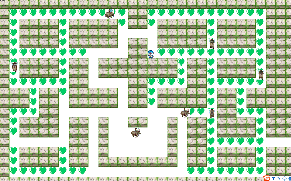

## 基于java的哆啦a梦历险记

> 运行方式：打开dn.five.Test包，运行GameBoard.java即可

#### 该项目诞生于一次java学习课下作业，要求以小组为单位设计制作一个小游戏，当时刚刚学了历史上有名的的java小游戏“飞机大战”，感觉自己厉害的不行，于是小组成员各抒己见，最后讨论出了几个小游戏：

> 吃豆子，泡泡堂，~~王者荣耀~~......
    
    
    
最后盘来盘去，终于盘出一个比较圆润一点的小游戏
    

    
>游戏的逻辑主要是这样，在几百万年前的火星上，一群外来生物正要攻占火星，勇敢而充满正义的哆啦A梦为了保卫自己的家园，与入侵者展开了一场激烈的搏斗。。。
    
#### 不扯淡了，其实逻辑就两个
1. 在所有的金币下面藏着一把通往下一关的要是，哆啦A梦需要找到钥匙并从通道进入下一关
2. 期间不能被入侵者追到，否则就挂了，入侵者有一个基地不断的涌出入侵者，并且入侵者的移动速度随着关数的增加会原来越快

#### 五大入侵者（残忍至极）：
    小猪，小鸟，小象，大马和小马





#### 言归正传，说点有用的    
##### 所用技术：
    1. java多线程
    2. 图片预加载
    3. 键盘事件监听
    4. java 的iframe操作
    
##### 精华

这个项目中还是有几个地方感觉处理的很好的
    
1. 地图实现

为了构造出地图的效果，整个画板是一个30*30的二维数组构建的，墙用0来表示，其他用1来表示，代表可以经过。可以将二维数组存放在一个文件中，使用的时候从中读取，这样就可以设计多个地图实现通关的效果。
    
```java
	public int[][] arrs = {
			{0,0,0,0,0,0,0,0,0,0,0,0,0,0,0,0,0,0,0,0,0,0,0,0,0,0,0,0,0,0},
			{0,1,1,1,1,1,1,1,1,1,1,1,1,0,0,1,1,1,1,1,1,1,1,1,1,1,1,0,0,0},
			{0,1,0,0,0,0,1,0,0,0,0,0,1,0,0,1,0,0,0,0,0,1,0,0,0,0,1,0,0,0},
			{0,1,0,0,0,0,1,0,0,0,0,0,1,1,1,1,0,0,0,0,0,1,0,0,0,0,1,0,0,0},
			{0,1,0,0,0,0,1,0,0,0,0,0,1,0,0,1,0,0,0,0,0,1,0,0,0,0,1,0,0,0},
			{0,1,1,1,1,1,1,1,1,1,1,1,1,0,0,1,1,1,1,1,1,1,1,1,1,1,1,0,0,0},
			{0,1,0,0,0,0,1,0,0,1,0,0,0,0,0,0,0,0,1,0,0,1,0,0,0,0,1,0,0,0},
			{0,1,0,0,0,0,1,0,0,1,0,0,0,0,0,0,0,0,1,0,0,1,0,0,0,0,1,0,0,0},
			{0,1,1,1,1,1,1,0,0,1,1,1,1,0,0,1,1,1,1,0,0,1,1,1,1,1,1,0,0,0},
			{0,0,0,1,0,0,1,0,0,0,0,0,1,0,0,1,0,0,0,0,0,1,0,0,1,0,0,0,0,0},
			{0,0,0,1,0,0,1,0,0,0,0,0,1,0,0,1,0,0,0,0,0,1,0,0,1,0,0,0,0,0},
			{0,1,1,1,0,0,1,1,1,1,1,1,1,1,1,1,1,1,1,1,1,1,0,0,1,1,1,0,0,0},
			{0,1,0,0,0,0,1,0,0,1,0,2,2,0,0,2,2,0,1,0,0,1,0,0,0,0,1,0,0,0},
			{0,1,0,0,0,0,1,0,0,1,0,2,2,2,2,2,2,0,1,0,0,1,0,0,0,0,1,0,0,0},
			{0,1,1,1,1,1,1,0,0,1,0,2,2,2,2,2,2,0,1,0,0,1,1,1,1,1,1,0,0,0},
			{0,1,0,0,0,0,1,0,0,1,0,2,2,2,2,2,2,0,1,0,0,1,0,0,0,0,1,0,0,0},
			{0,1,0,0,0,0,1,0,0,1,0,0,0,0,0,0,0,0,1,0,0,1,0,0,0,0,1,0,0,0},
			{0,1,1,1,1,1,1,1,1,1,1,1,1,1,1,1,1,1,1,1,1,1,1,1,1,1,1,0,0,0},
			{0,0,0,0,0,0,0,0,0,0,0,0,0,0,0,0,0,0,0,0,0,0,0,0,0,0,0,0,0,0},
		};
```
2. 碰撞检测

想要判断两个物体是否碰撞很简单，但是逻辑上当哆啦A梦碰到墙的时候应该是不会反弹的，而是不动，或者是在不该转弯的地方转弯，这样就容易出现一个bug，卡到墙里，所以这里的解决方案，是给每个运动的物体都加了一个方法canChangWay()来判断是否可以转弯，即试着转一下，如果不行就回滚一步

```java
    /*预设是否可以改变方向*/
	public boolean canChangWay(Block[] blocks,int dic) {
		int reDic = this.getDirection();
		this.setDirection(dic);
		this.step();
		if(this.isHitBlock(blocks)) {
			this.reStep();
			this.setDirection(reDic);
			return false;
		}else {
			this.reStep();
			this.setDirection(reDic);
			return true;
		}
	}
	
```

3. 自动校位

因为哆啦A梦改变方向是由键盘控制，可是哆啦A梦的体型又差不多和通道一样宽，所以要想在与通道刚好吻合的时间段里点击键盘比较困难，所有添加了这个方法autoPosition(),就可以使用户操作时，只要当前的误差范围在一定程度，多可以通过弯道，提升了用户体验

```java
    /*自动校位*/
	public void autoPosition(Eater eater,Bean[] beans) {
		for(int i = 0;i<beans.length;i++) {
			if(eater.canBeEat(beans[i])){
				int x1 = eater.getX();
				int y1 = eater.getY();
				int x2 = beans[i].getX();
				int y2 = beans[i].getY();
				int x3 = x1 - x2;
				int y3 = y1 - y2;
				if(x3>= -eater.getWidth()/2 && x3<=eater.getWidth()/2 && y3 >= -eater.getHeight()/2 && y3 <= eater.getHeight()/2) {
					eater.setX(x2);
					eater.setY(y2);
				}
			}
		}
		
	}

```

4、图片刷新
    
因为每一个生物都有16张图片，分别是上下左右各四张，所以需要不停地刷新图片的同时还要判断该生物当前的方向，这里用index%4+4*x，就可以使在同一个方向上只滚动该方向上的图片。

```java
    switch(this.direction) {
		case 1:
			return images1[index%4];
		case 2:
			return images1[index%4+4];
		case 3:
			return images1[index%4+8];
		case 4:
			return images1[index%4+12];
	}
```

#### 收获

对面向对象编程的理解更加深刻了
